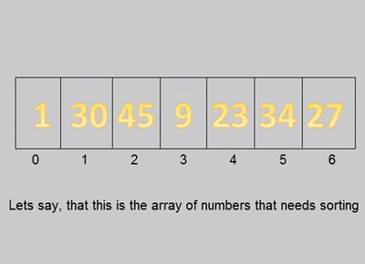
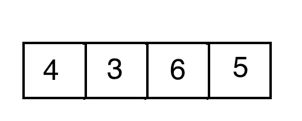

# Sorting Algorithms

### Bubble sort

### Bucket sort

### Heap sort

### Insertion sort

### Merge sort

### Quick sort

### Radix sort

### Selection sort

### Comparison

| Algorithm | Best | Average | Worst | Memory |
| :-------: | :--: | :-----: | :---: | :----: |
| Bubble sort | n | n^2 | n^2 | 1 |
| Bucket sort | - | n + k | n^2 * k | n * k |
| Heap sort | n * log n | n * log n | n * log n | 1 |
| Insertion sort | n | n^2 | n^2 | 1 |
| Merge sort | n * log n |  n * log n  |  n * log n  | n |
| Quick sort | n * log n | n * log n | n^2 | log n |
| Radix sort | - | n * k/d | n * k/d | n + 2^d |
| Selection sort | n^2 | n^2 | n^2 | 1 |

Memory -> Auxiliary storage needed beyond that used by the list itself.
